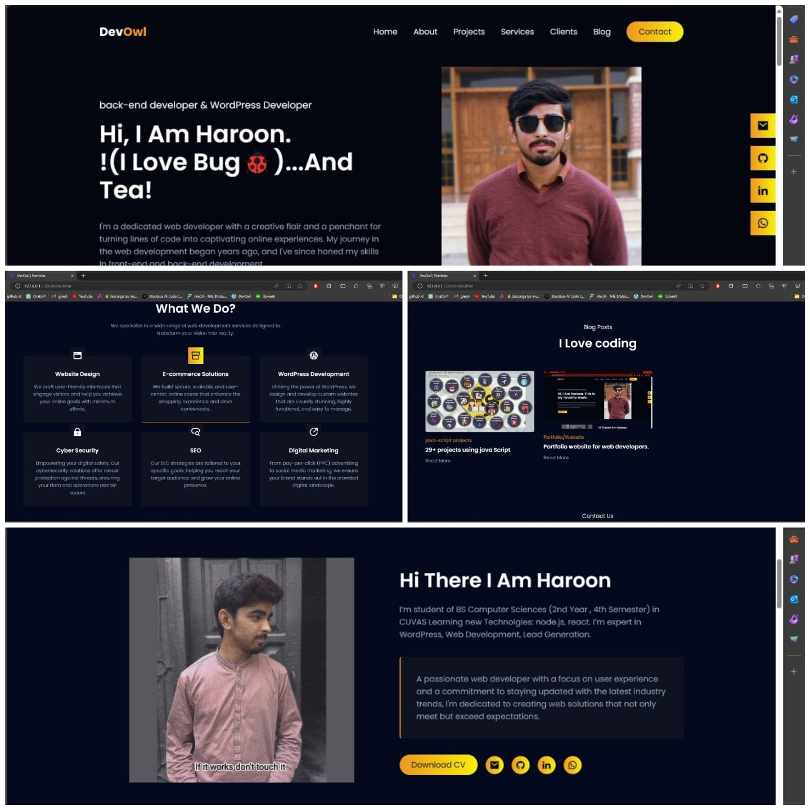

# Portfolio
<h1>Welcome to My Dynamic Portfolio Website!</h1>

<h2>Preview</h2>



Welcome to my vibrant and immersive portfolio website! Here, I showcase my expertise, projects, and professional journey in the ever-evolving world of web development. Crafted with passion and precision, this website offers visitors an engaging experience as they explore my work and accomplishments.

## 🚀 Features

- **About Me:** Dive into a captivating introduction that paints a vivid picture of who I am, my passions, and my journey in Web Development. From my core values to my aspirations, this section provides a glimpse into my personality and what drives me professionally.

- **Projects:** Embark on a journey through my diverse portfolio of projects, each meticulously crafted and thoughtfully presented. Whether it's stunning web applications, innovative mobile apps, or cutting-edge software solutions, these projects showcase my versatility, creativity, and technical prowess.

- **Resume:** Elevate your understanding of my qualifications and experiences with a comprehensive resume or CV. From my educational background to my professional achievements, this document offers a detailed overview of my skills, accomplishments, and credentials.

- **Contact:** Engage with me directly via email or through the seamless contact form integrated into the website. Whether you're a potential employer, collaborator, or enthusiast, I'm eager to connect and explore exciting opportunities together.

## 🛠️ Technologies Used

- **Frontend:** HTML5, CSS3 (with Sass for enhanced styling), JavaScript (ES6+)
- **Frameworks/Libraries:**  Bootstrap, React.js, Vue.js
- **Version Control:** Git, GitHub

## 🚀 Getting Started

Ready to explore my portfolio website or contribute to its growth? Follow these simple steps:

1. **Clone this repository** to your local machine:

```bash
https://github.com/ImMohammadHaroon/ImMohammadHaroon.github.io.git
```

2. **Open the `index.html` file** in your preferred web browser to experience the website firsthand.

3. **Interested in contributing?** Check out the [CONTRIBUTING.md](CONTRIBUTING.md) file for detailed guidelines and best practices.

## 💬 Feedback

Your feedback is invaluable in shaping the future of this portfolio website. Whether you have suggestions for improvement, ideas for new features, or simply want to share your thoughts, I'm eager to hear from you! Don't hesitate to open an issue or reach out to me directly.


## 🌐 Connect with Me

Let's stay connected! Follow me on [LinkedIn](https://linkedin.com/in/muhammad-haroon-6575b0285) for the latest updates, industry insights, and opportunities to collaborate.


Crafted with ❤️ by Haroon. Elevate your digital experience with my portfolio website and let's embark on a journey of innovation and collaboration together.

